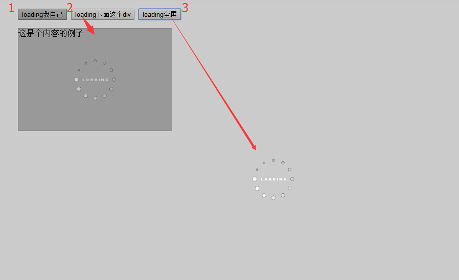

# loading
loading...
效果图如下：

**[DEMO请点击这里查看.](http://www.lovewebgames.com/jsmodule/loading.html "loading demo")**
# 调用示例
html:

	

		<input type="button" id="loading1" value="loading我自己">
		<input type="button" id="loading2" value="loading下面这个div">
		<input type="button" id="loading3" value="loading全屏">
	

	
这是个内容的例子

	
	
js:

	//loading我自己
	$('#loading1').click(function(){
		var load = new Loading();
		load.init({
			target: this
		});
		load.start();
		setTimeout(function() {
			load.stop();
		}, 3000)
	});
	//loading下面这个div
	$('#loading2').click(function(){
		var load = new Loading();
		load.init({
			target: "#loading-content"
		});
		load.start();
		setTimeout(function() {
			load.stop();
		}, 3000)
	});
	//loading全屏
	$('#loading3').click(function(){
		var load = new Loading();
		load.init();
		load.start();
		setTimeout(function() {
			load.stop();
		}, 30000)
	});
# API
## 属性
### target:string||dom
	需要显示loading的节点，不传值时显示全屏的loading
## 方法
### start:function()
	开始loading
### stop:function()
	结束loading
## 事件
### stop
	target的stop事件触发时，结束loading. 如
	$('html').trigger('stop')会结束全屏的loading动画.
